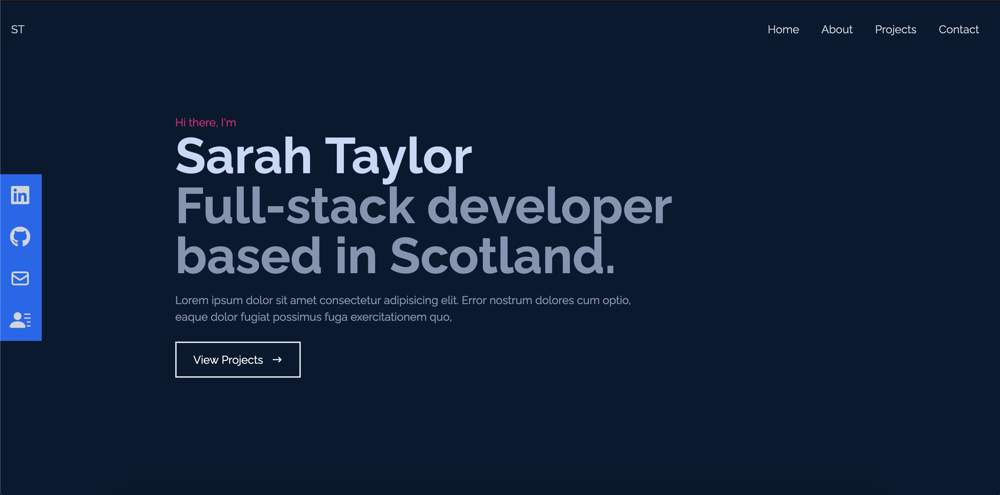

# My Portfolio
A clean, responsive portfolio.

## How it's made
Tech: React, Tailwind, HTML5, CSS3

For this project I wanted to focus on modern styling, making the website smooth and responsive.
I used tailwind for a styling framework, which definitely facilitated making components responsive. 
React-scroll npm package is used here for the smooth scroll animations from the navigation. 

## Optimisations
To further improve on this project, I would look into implementing a light/dark mode. I would also like to explore using Lighthouse in tandem with Netlify to assess the accessibility of the site, and improve my awareness of these issues in projects going forwards.

I also think the styling of the project could be improved on; perhaps a scrolling animation of the site, or a modal to provide a brief description. 

## Lessons learned
This project was an opportunity for me to learn a front-end styling framework, in this case TailwindCSS. I chose Tailwind CSS as not only a popular choice, but the customisability of components with this framework. TailwindCSS does not have pre-built components however, so my styling skills were tested here! 

My initial experience with Tailwind was that it felt 'wrong' to violate separation of concerns, however it is certainly convenient to be able to style components directly in isolation. Maintaining consistency was more of a challenge, but as each component has its own layout this was not a major hurdle. For this project I ended up really enjoying how compartmentalised the css was, the ease of making components responsive, and especially the speed of using the short-hand format.
